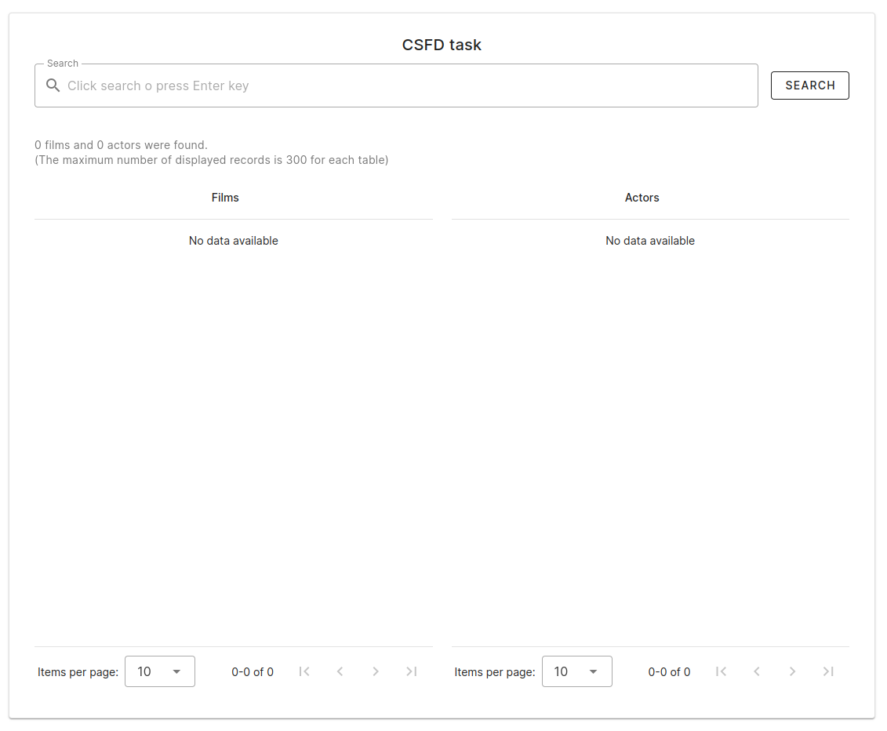
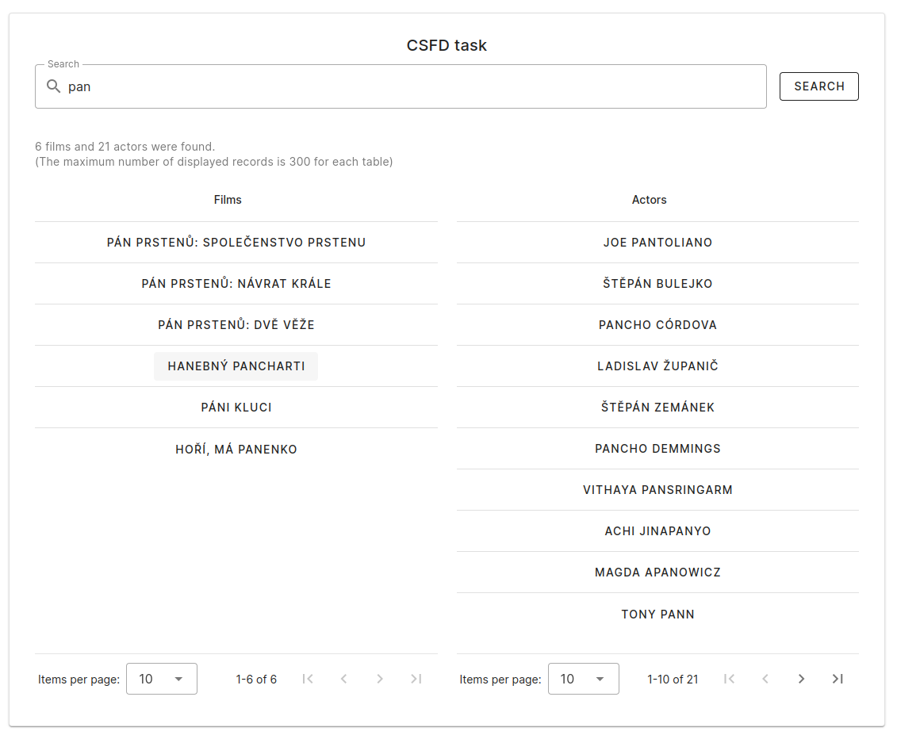
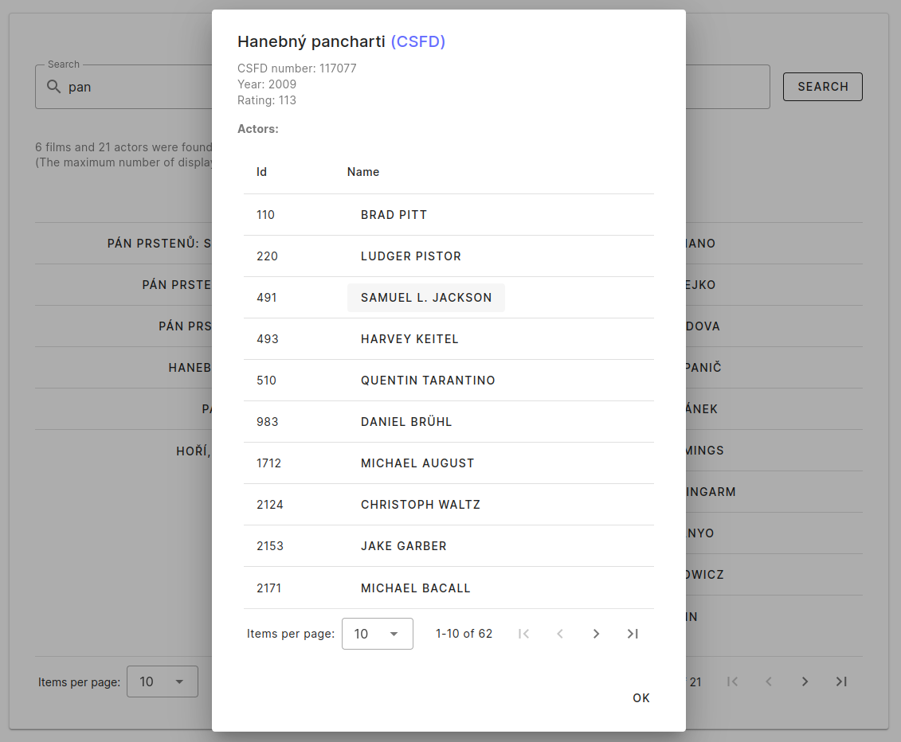
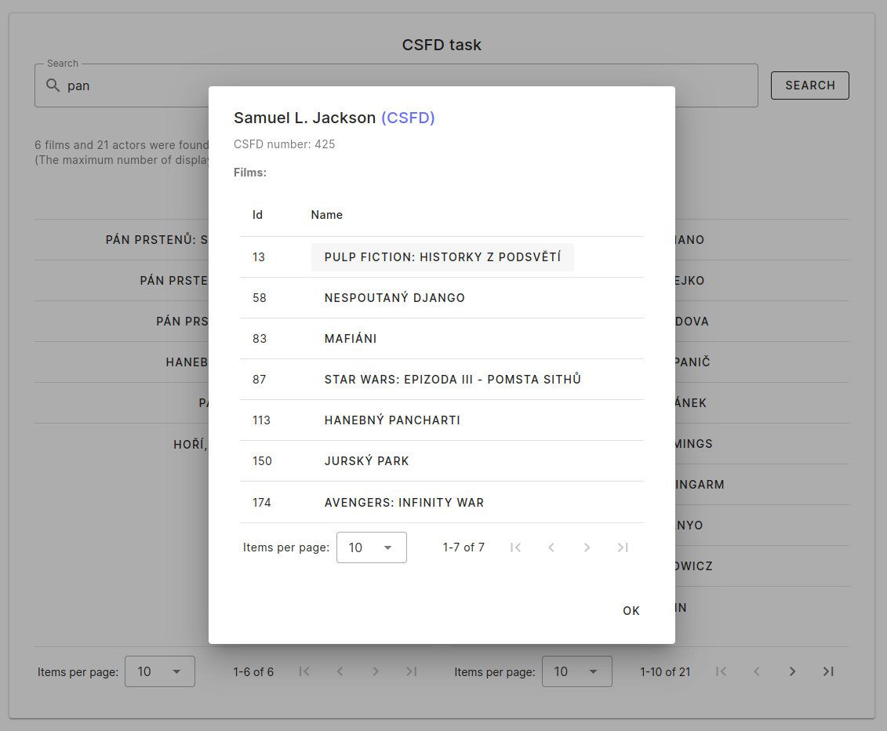
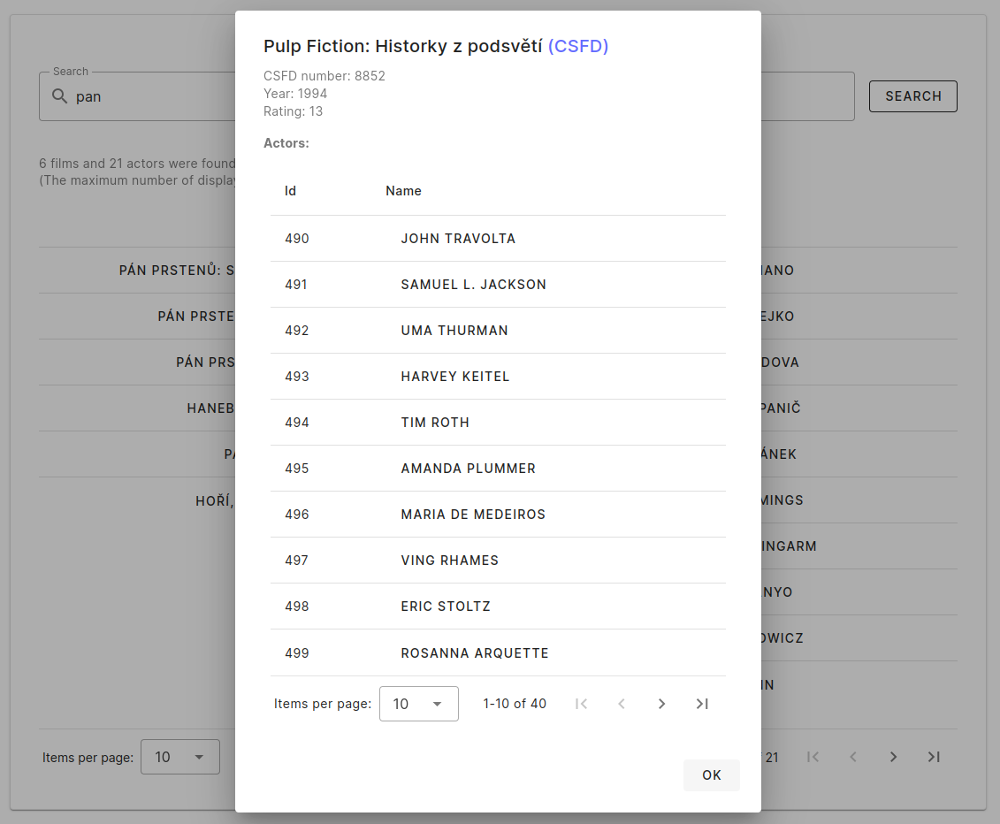
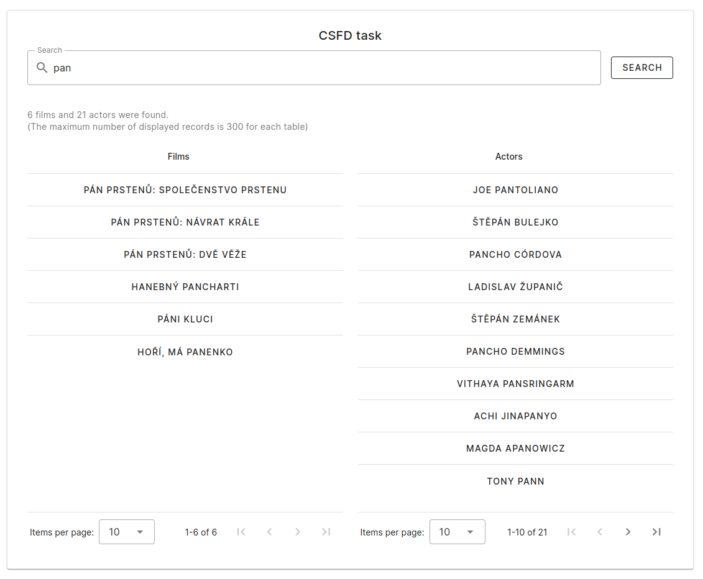

# csfd-task-frontend

### Install dependencies (or npm install)
```sh
pnpm install
```

### Config (config.js)
#### Backend: http://127.0.0.1:8000/ (can be changed in config file)

### Run
```sh
pnpm run dev
```

### Screenshots
#### Screens 1:



#### Screens 2:




